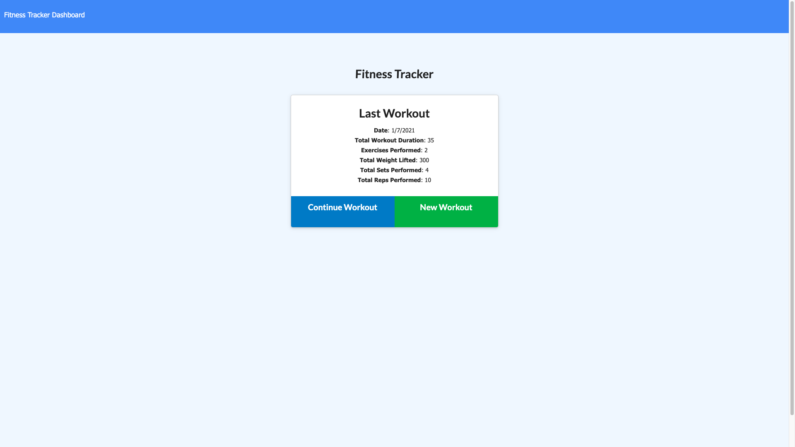
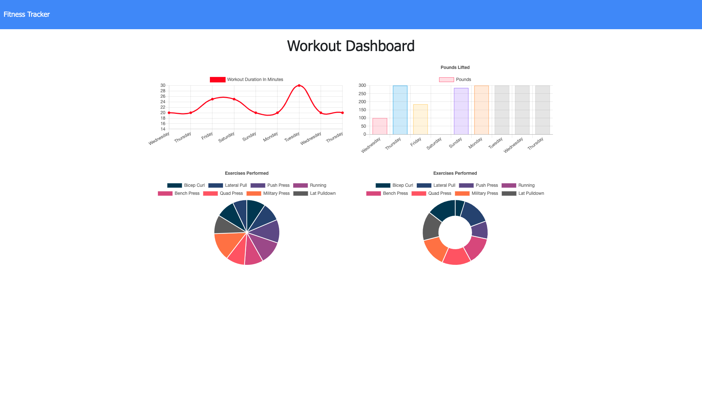

# Fitness Tracker

# Table of Contents

[Description](#description)

[Technologies Used](#technologies-used)

[Screenshots](#application-screenshots)

[Installation](#installation)

[Application Usage](#usage)

[Credits](#credits)

[Deployed Application](#deployed-application)

[License](#license)

## Description

A web application for tracking your workouts

## Technologies Used

NodeJS, NPM, Mongoose, MongoDB

## Application Screenshots

### Homepage

  

### Dashboard

## Installation

Clone repo to local machine. navigate to directory in terminal. Run npm install to get all dependencies.

## Usage

run npm start from terminal and load application in browser. once loaded you can create a new workout and beginning adding activities (resistance or cardio) training. once completed you and either add additional exercises or hit complete button. from home screen you can to to the dashboard where your workouts will be visually displayed on graphs

## Credits

All developers of the technologies used

## Deployed Application

https://arcane-gorge-03230.herokuapp.com/

## Demo Video

https://drive.google.com/file/d/1I9nN-LJbDKLz8V610AfjjBEr-55gGFE0/view

## License

Licensed under the [MIT](LICENSE) license.
